# 動作確認

以下手順に従い、動作確認を行ってください。  

- [動作確認](#動作確認)
  - [構成図](#構成図)
  - [1.GitHubリポジトリのFork](#1githubリポジトリのfork)
  - [2.Codespaceの作成](#2codespaceの作成)
  - [3.Webアプリケーションの起動確認](#3webアプリケーションの起動確認)
  - [4.Webアプリケーションの終了](#4webアプリケーションの終了)
  - [もう一度起動したい場合](#もう一度起動したい場合)

## 構成図

本手順によって構築される環境の概念図は以下のようになります。

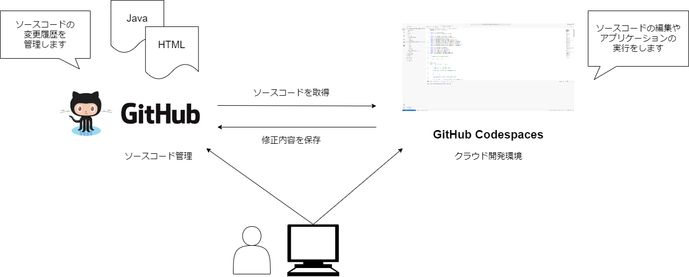

## 1.GitHubリポジトリのFork

以降の作業は[Google Chrome](https://www.google.com/intl/ja/chrome/gsem/download/?brand=YTUH&gclid=EAIaIQobChMI4fnFyaPKggMV9dAWBR1dLA90EAAYASAAEgLaUfD_BwE&gclsrc=aw.ds)で実施してください。  

1. 以下を押下し、Webアプリケーションにアクセスして下さい。  
   1. https://github.com/tiscon/tiscon11
2. GitHubの画面右上 `Fork` ボタンを押下します。  
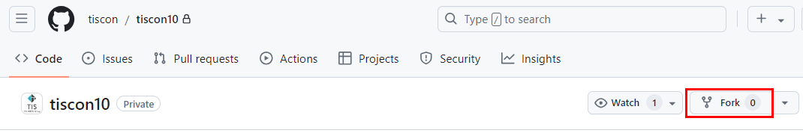
1. `Create fork` を押下します。画面が切り替わります。  
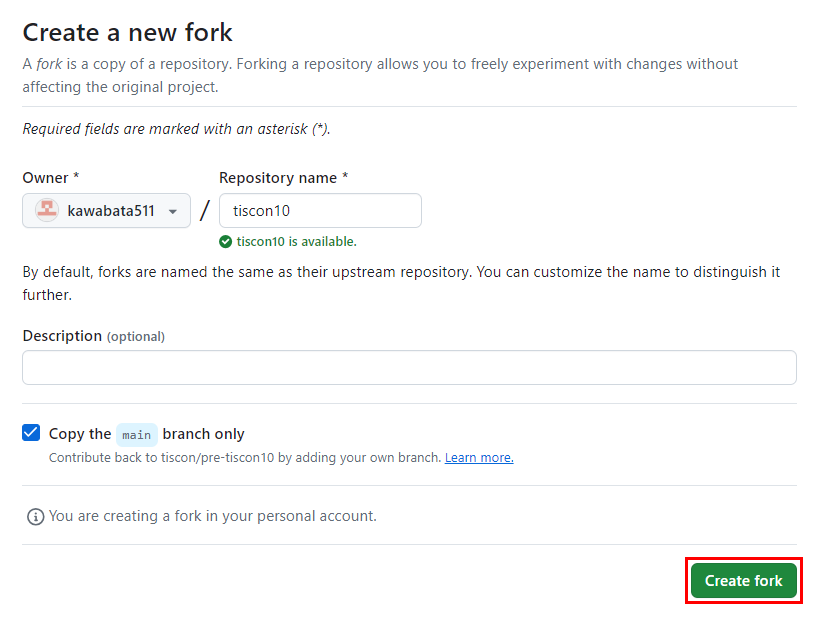

1. 画面左上で `[自分のGitHubユーザ名] / tiscon11` となっていればOKです。  
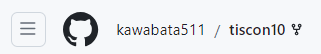

## 2.Codespaceの作成
1. `Code` を押下します。  
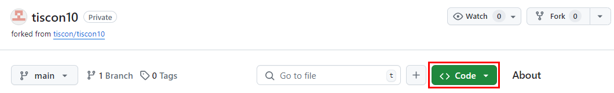

1. タブを`Codespaces`に切り替え、`Create codespace on main`を押下します。　　
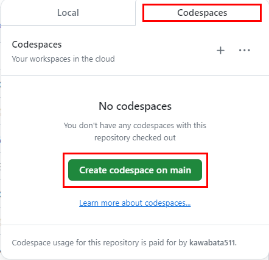

1. 起動が完了するまで1,2分程度待ちます。  
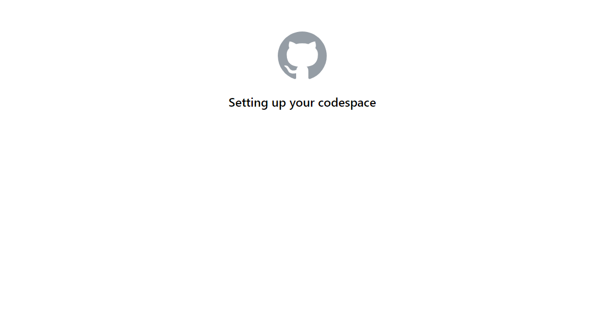

1. 以下のような画面に遷移し、プロジェクト内のソースコードが確認できるようになりました。  
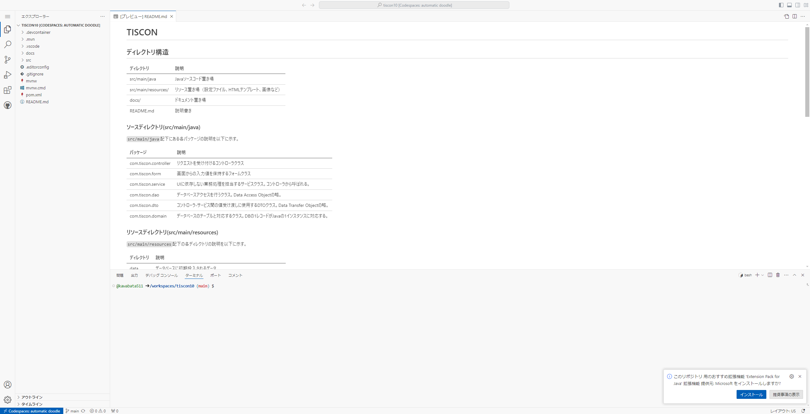

## 3.Webアプリケーションの起動確認

1. 画面左の `Spring Boot Dashboard` というボタンを押下します。  
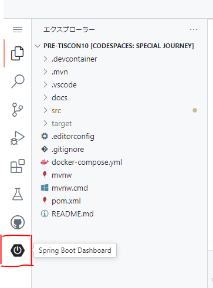
1. `tiscon11` と書いてある部分にカーソルを合わせ、 `Run` を押下します。  
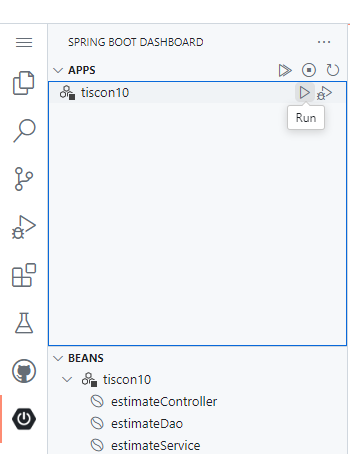
1. `Started tiscon11Application` と表示されていればOKです。  
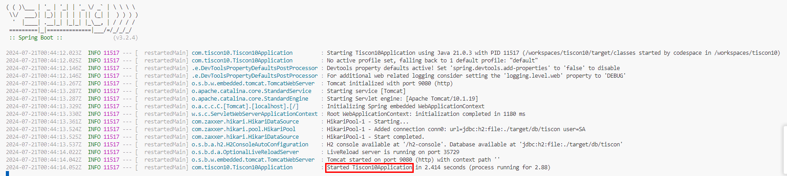
1. 画面右下 `ブラウザーで開く` を押下し、ブラウザを開いて画面が表示されることを確認します。  
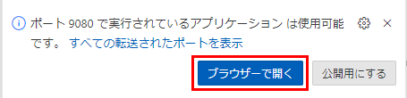
1. 通知が消えてしまっている場合は `ポート` タブを押下し、 `9080` と書かれた行の `転送されたアドレス` にカーソルを合わると、 `ブラウザーで開く` という地球儀マークが出てきます。これを押下すると画面が立ち上がります。  
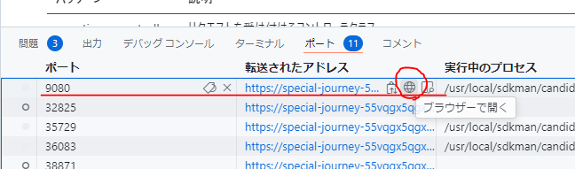
1. 以下のような画面が立ち上がったらOKです。  

## 4.Webアプリケーションの終了

動作が確認できたらアプリケーションを終了しましょう。  

1. Codespace画面左下の `Codespaces: …` と書かれたボタンを押下します。  
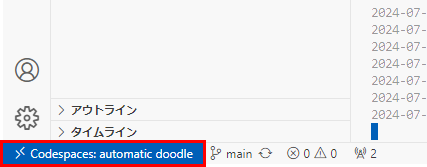
1. 画面上部に表示された `Stop Current Codespace` を押下します。  
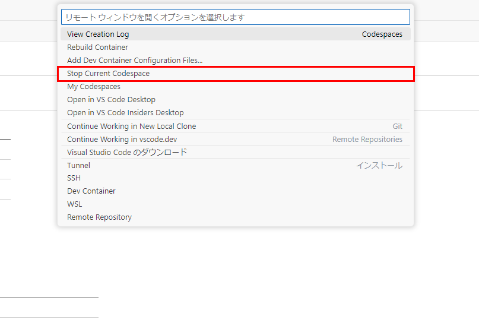
1. Codespaceの停止を知らせる画面が表示されればOKです。  
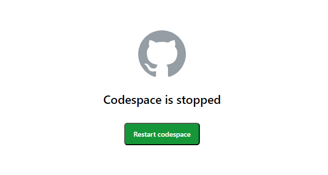

## もう一度起動したい場合

1. `https://github.com/[自分のGitHubユーザ名]/tiscon11`にアクセスし、`Code`を押下します。

1. `Codespaces`タブを選択し、スペース名を押下します。  
※ スペース名はランダムです。  

Codespaceが表示されたら、 `Spring Boot Dashboard` から `run` を押下することで起動することができます。  

__お疲れ様でした！次は事前学習へ進んでください。__  
